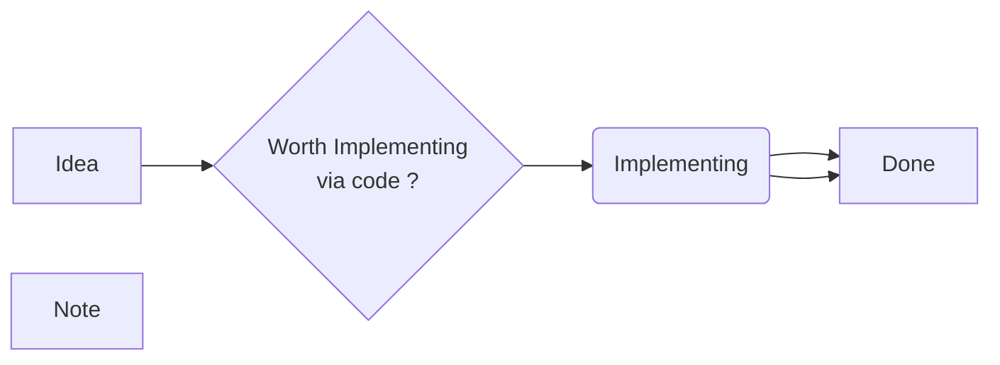

# Introduction to Markdown

**Markdown**

- is a lightweight markup language created by John Gruber in 2004.
- It allows you to format plain text using simple syntax, which is then converted to HTML or other formats. This document can be rendered here live. While aslo the live preview rendered maintain the form

- is widely used for documentation (e.g., GitHub READMEs),
  forums (e.g., Reddit), note-taking apps (e.g., Obsidian),
  and static site generators (e.g., Jekyll, Hugo).

I can create diagram block here and no problem due to Nootropy built-in Mermaid extension via mystparser

Multiple \[Shift + Enter\] in visual editor should cause multiple new lines and these  empty spaces        + new lines are not affected by the resizing.
One single \[Shift + Enter\] here is fine and generate the same.

Multiple \[Shift + Enter\] create new blocks.

This should just be a new paragraph withing the block but we have multiple cursor in the text document where some characters might be missing in the next block.

I deleted the bad paragraph that were created by the double \[Shift + Entnter\] followed by some typing. Writing in the visual editor always emit the debug message from the extentions.

