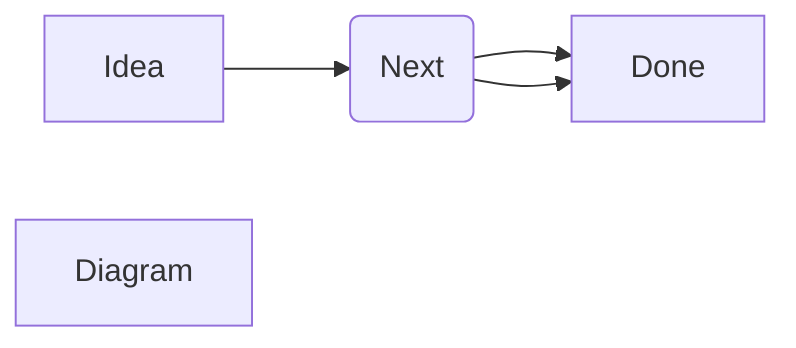

# Introduction to Markdown

**Markdown**

- is a lightweight markup language created by John Gruber in 2004.
- It allows you to format plain text using simple syntax, which is then converted to HTML or other formats. This document can be rendered here live. While aslo the live preview rendered maintain the form

- is widely used for documentation (e.g., GitHub READMEs),
  forums (e.g., Reddit), note-taking apps (e.g., Obsidian),
  and static site generators (e.g., Jekyll, Hugo).

I can create block here and no problem.

