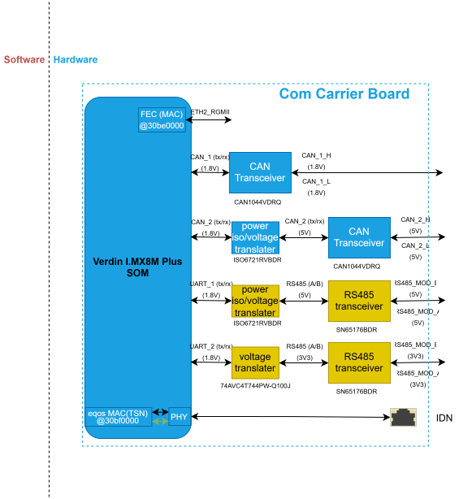
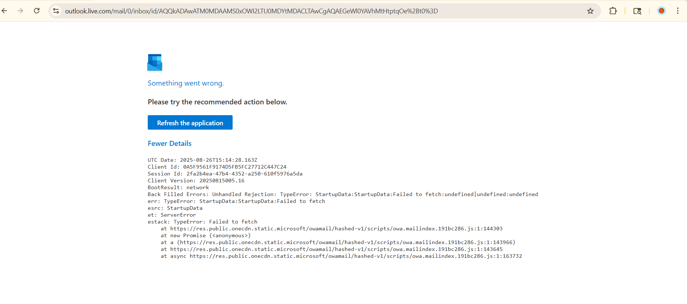

Nootropy Introduction
========================

This page demonstrates the vscode live markup preview extension, Nootropy. 
Edit this file in VS Code and watch the preview panel update in near real-time.

Features
--------

- Fast, in-process reST parsing with docutils
- Incremental, block-level preview updates
- Sphinx-compatible directives and roles

.. note::

   This is a Sphinx-style admonition. Vanilla docutils already understands
   ``note``, ``warning``, ``tip``, and friends.

.. warning:: This is a warning 

.. tip:: This is a tip 

.. admonition:: my admonition

    admonition content 

.. important:: 
   
   This is an important note. 

.. code-block:: c

   if (python) {
       render();
   }

See :doc:`index` for the table of contents, and :ref:`intro` for this
section.

I want fast reloading of the project and this is working so great.

How can this be so fast

.. code-block:: python 

    if c++

rendering is fast. The test is very fast in the

**test** *italics*, ``car``

This is previewing the AST live as well.

|

I cannot believe this is rendering the project so fast as i type.

Custom Markup 
---------------

**Testing new features**

1. Strike 

   ~strike text~

   :strike:`another strike text <red>`

#. Underline 
   
   :underline:`underline inline text` 
   :underline:`inline text <red>`
   
   |

   .. underline::
     :color: yellow 

     An underline paragraph that can 
     span multi-line.

     A new paragraph start here. 

     Another paragraph starts here.

     :color:`in block green text <green>` 
   
   |

   .. underline::
      :color: green
       
       An underline paragraph that can 
       span multi-line.
   
       A new paragraph start here. 
   
       Another paragraph starts here. 
   
#. color 
  
   - :color:`red text <red>` 
   - *paragraph*
     
     .. color:: red
 
         sample red
         paragraph 
 
         multi-paragraph

         | new paragraph obeying the 
         | line span
   
   - single or multi character color: :color:`r<red>`\ed :color:`y<yellow>`\ :color:`gr<green>`
   - color with escape :color:`no real red here \<red\>`
   - can the color parameter be anywhere or only at the end: ans => only at the end.
     
     1. :color:`<yellow> yellow text with parameter up front..no color apply`
     2. :color:`yellow text <yellow> with parameter in the middle..no color apply`
   
   - color accepting any css hex value: :color:`text with hex color(#810e68) <#810e68>`
   - color accepting any rgb value: :color:`text with color rgb(14, 104, 129);<rgb(14, 104, 129)>`
   - color accepting any rgb value: :color:`text with color rgba(255, 99, 71, 0.5) <rgba(255, 99, 71, 0.5)>`
   - color accepting any hsl value: :color:`text with color hsl(13, 80%, 28%);<hsl(13, 80%, 28%)>`
   - color accepting any hsla value: :color:`text with color hsla(9, 100%, 64%, 1) <hsla(9, 100%, 64%, 1)>`
  

#. highlighted 
   
   :mark:`inline highlighted text` 
   :mark:`green text <green>`

   - paragraph 
   

     .. mark::
        :color: #0f974c77 

        Highlighted paragraph
        text starts here.

        The world is not all sunshine and rainbow...New paragraph

        *italic* **bold** ``inline`` in new paragraph

This is not doing the auto scrolling smoothly. This is still very fast.
I can see the document rendered live.

:mark:`text with bad color parameter <badcolor>`
:mark:`real purple text.<purple>`
:mark:`No real purple should apply to the text here due to escape should work \<purple\>`
:mark:`highlighted inline interpreted text with rgb couch green <rgb(104, 129, 14)>`
----

Checking for fast rendering...still fast. yes indeed.
:style:`Inline compose text that can span multiple lines and that still render 
fast as I type, which also uses a different font <bold italic mono bg=yellow underline=green strike=blue 
font="Lucida Console">` Regular
text after that.

The rendering is still very fast even with all the profiling of new code.

.. style:: bold color=gray underline=red

   A whole styled paragraph, still with *nested emphasis* working normally. 
   even if the paragraph span many lines or is a multi paragraph document, then 
   we can view the document.

   Another paragraph starts... ``ok`` 

.. style::
   :color: cyan
   :underline: yellow
   :bg: black

   A whole styled paragraph with cyan text, black background color, yellow underline
   but no default strike color, 
   **still** with *nested emphasis*  working ~normally~. :strike:`Another strike text no color specified`. 
   :strike:`strike text using yellow strike <yellow>`
   Even if the paragraph span many lines or is a multi paragraph document, then 
   we can view the document.

   Another paragraph starts...ok  

~struck through~

.. style::
   :color: cyan
   :underline: yellow
   :mark: black
   :strike: red

   A whole styled paragraph with cyan text, black background color, yellow underline
   and :color:`red <red>` text color, **still** with *nested emphasis* 
   working ~normally~. :strike:`A text with no strike color specified will get the a
   strike line that match the text color`. 
   :strike:`strike with yellow strike color specified <yellow>`
   Even if the paragraph span many lines or is a multi paragraph document, then 
   we can still use the parsed syntax normally.

   Another paragraph starts...ok  

.. style::
   :color: cyan
   :underline: yellow
   :mark: black
   :bg: lightblue
   :strike: red

   A whole styled paragraph with cyan text, black background color, yellow underline
   and :color:`red <red>` text color, **still** with *nested emphasis* 
   working ~normally~. :strike:`A text with no strike color specified will get the a
   strike line that match the text color`. 
   :strike:`strike with yellow strike color specified <yellow>`
   Even if the paragraph span many lines or is a multi paragraph document, then 
   we can still use the parsed syntax normally.

   Another paragraph starts...\ ``ok``

----

*italic with escape star symbol\**

.. tip:: The error is fixed now.

1. numbered list 
   
   * bullet list 

   This sis still fast

----

.. container:: custom-box

   This text and the paragraph below are wrapped 
   inside a single HTML div element with the class 
   "custom-box".
   
   * List item one
   * List item two

A simple note for the world to see still render very fast.

----

1. A list there 
   
   I. nested list there
   #. List continuation 
      
      A. another nested level
      #. Another level 
         
         1. subnested sublevel 
         #. continuation

#. Line continuation 
#. ..

.. a comment

A paragraph after the comment with **bold text**, *emphasis*, and ~strike <green>~

.. list-table:: a simple table 
   
   * - row 1 col1
     - row 1 col 2

let's check if it still render fast. yes. **bold**

.. code:: python

    if(python == "python3")
    else()

    for(int in v.)

even deleting whole block or moving them around is very fast.

Colorized Math Smoke Test
--------------------------

.. colorized-math::

   a^2 + \textcolor{2266cc}{b}^2 = \textcolor{c0392b}{c}^2

   2266cc: the shorter leg
   c0392b: the hypotenuse

- testing with just ``.. math::`` also colorize the symbols

  .. math::
  
     a^2 + \textcolor{2266cc}{b}^2 = \textcolor{c0392b}{c}^2

- markdown style math using ``$$`` not rendered. Need explicit directive ``:math:`` 

$$x = \frac{-b \pm \sqrt{b^2 - 4ac}}{2a}$$

`Katex renderer <https://katex.org/docs/supported>`_

- using explicit directive ``.. math::``
  
  .. math::
     
     \boxed{\pi=\frac c d}
  
  .. math::
     
     \sqrt[3]{x}
  
  .. math::
     
     \def\arraystretch{1.5}
        \begin{array}{c:c:c}
        a & b & c \\ \hline
        d & e & f \\
        \hdashline
        g & h & i
     \end{array}
     
  .. math::

     
     x = \frac{-b \pm \sqrt{b^2 - 4ac}}{2a}

  
  .. math::

     \begin{aligned}
     V &= IR \\
     P &= VI \\
     P &= I^2R
     \end{aligned}
  
  .. math::

     V_{out} = V_{in} \frac{R_2}{R_1 + R_2}
  
  .. math::
     
     \textcolor{#228B22}{F=ma}
  
  .. math::
     
     ∀∴∁∵∃∣∈∈
     ∋⊂⊃∧∨↦→←↔¬ ℂ ℍ ℕ ℙ ℚ ℝ

  .. math::
     
     \colorbox{aqua}{$F=ma$}
  
  .. math:: 
     
     \Braket{ ϕ | \frac{∂^2}{∂ t^2} | ψ }
  
  .. math::
     
     \Bra{\phi}
   
  .. math::
      
     y(t) =
     \frac{d}{dt}
     \left[
        \int_{0}^{t}
        \sum_{n=1}^{N}
        \left(
           \prod_{k=1}^{n} k
        \right)
        x^n(\tau)
        \,d\tau
     \right]
     
- Matrix operation:
  
  .. math:: 
     
     \begin{pmatrix} a & b \\ c & d \end{pmatrix}

- edit the intro while claude is checking what is triggering sphinx-build 
  when in rst preview mode.

  - need to understand what part of the code triggered sphinx build.
  - old flask app.py was triggering the sphinx-build and causing intro.html to be updated

- can you use color with math directive? **No**

  .. math::
  
      y = 2x + 3 \
  
      :color:`s <red>` = 2\ :color:`y <yellow>` + 4
  
  .. math::
      
      *given the expressions*

| timestamp: 08/15/2026 4:16PM edit.
| timestamp: 08/15/2026 4:21PM edit.
| timestamp: 08/15/2026 4:34PM edit.

other 3rd party extensions
----------------------------

.. uml::

   Alice -> Bob: Hello
   Bob --> Alice: Hi there
   Alice -> Bob: How are you?
   Bob --> Alice: I'm good, thanks!

.. drawio-image:: ../../_images/src/Sphinx.drawio

checking for fast rendering still.. yes
checking for fast rendering...still fast. yes indeed.

.. drawio-image:: ../../_images/src/Sphinx.drawio
   :page-index: 1
   :width: 500px
