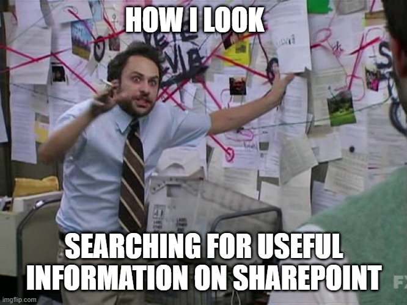

.. .. contents:: 
..    :depth: 4

Richelin's Digital Notebook
##############################

**Release Date**: |release_date|

|

Welcome to Richelin's Digital Notebook ( Knowledge Library) !!!

Intro 
********

**What is this document?**

This doc 

* is the most basic template needed to start documenting project or taking notes 
  digitally.

  * you can use it for classes/courses note taking, or to create 
    scientific document for publishing, assuming you have the right 
    extensions in place and have configured the project according to your needs.
  
* it uses Python Sphinx as a static-html or pdf document generator by only using markdown or
  restructured text as the markup language. 

* This epitomizes the "documentation as code philosophy" thus making it easier to put these 
  document under version control (SVN, Git-SCM) as needed. **Note**: Using a source control
  management software such as Git can provide flexibility on how to manage many different 
  files, pull docs from many git source and publish the documentation outputs to a platform 
  such as sharepoint or other hosting platform such as `Read the Docs <https://about.readthedocs.com/>`_

* This makes it possible for me to share my notes with peers and spread the 
  knowledge (on sharepoint for example)

* This doc is similar to a forever evolving blog.
* it will continue to evolve as more tools are being developed, integrated into 
  the python or Javascript ecosystem. If better alternative to `Sphinx`_ for rst, .md compatible
  documents are available, they will be documented in ``docs_TechnicalDocumentation`` 
  repository instead of the local copy added in this template.

.. sidebar:: It is also possible to use Jupyter Notebook with markdown (MyST) and use 
   `Jupyter Book <https://jupyterbook.org/en/stable/intro.html>`_
   to create beautiful "executable" book from the ``*.ipynb`` jupyter files.

   * To combine multi sphinx project, you can either use the git workflow with submodule 
     or you can do something more complex with custom scripts, to aggrade all your 
     documents in one place and build a single release or multiple releases. You are 
     only limited by your creativity. The same way you write code for complex 
     project, you can do that with documentation as code (CI/CD, DVCS, docker, etc...).
   
   .. note:: This template is not meant to add that complexity. It is the 
       simplest and most basic way to get started. 
       
   .. seealso:: To do more inter-sphinx 
      and multi sphinx projects, checkout the 
      `Shpinx-multiproject documentation <https://sphinx-multiproject.readthedocs.io/en/latest/>`_

------

Motivation
===========

|

.. collapse:: Show/Hide My motivation for adopting Documentation as Code 
   :open: 
   
   | First drafted on *June 04, 2018*

   My best friend wanted to prepare in advance for classes he will take in the 
   fall semester, asked for my notes. A few days later he said they were 
   useful but he had to decipher my handwriting. As a former pre-med student, I 
   somewhat developed a doctor's style of writing it seems. Thus began my journey 
   to use digital tool to take notes. I tried various 
   available Microsoft products, Word, OneNote, but they were limited. 

   I wanted a tool with the following features: The tool 

   1. shall not limit one to an ecosystem and should offer flexibility.
   2. should integrate well with version control and offer a way to 
      show the difference between various versions.
   #. shall provide shareability to facilitate collaboration.
   #. shall be searchable
   #. shall be extensible and customizable by the user
   #. shall support scientific notation, code snippet integration, and have 
      various features for rich content.

      * a plus if it has ink support 
    
   .. note to self => the full requirement is in the noterenderer project in 
      a file titled Research_ideas

   **The goals**:

   * The tool should be a self-contained note taking engine which meets the 
     aforementioned features and
   * should serve as a second brain:

     Just like the scientific method, or how a bunch of researcher may look at a 
     paper and replicate the result of an experiment in a lab, is it possible to reach 
     a high level of understanding if you train your mind to recreate the same exact 
     step someone took to arrive a difficult solution?

     * For example, you see how I create linkage of information, see connection 
       between different topics/ subjects

       * How they can complement each other
       * And how they can help create a mental picture of an overall system

     * What if you trace the learning pattern of someone, their thought process
     * You have the same exact information they do
     * You learn it in the same sequence they have
     * So in other words

       [it’s like] you are replicating
         
       * Their experience
         
       * The sequence of step they took to be better at what they do.

     * Can someone reach that level of expertise in a smaller amount of time if the 
       steps/processes are well documented? Involve mind map if possible.
     * [it's] a mimicry process where you delve into that person’s experience.

   Information is key. If you have the right amount of information, enough to fill 
   in the void, the knowledge missing in your mind, the more you can accomplish.

   .. note:: The brain is good at filling gaps and recognizing shapes, why not 
      shorting the reading time by using that to our advantage. (My friend 
      like to skim text and not much of a reader).

      The verbosity in textbooks or blogs can be superfluous or contains irrelevant 
      information.

      | **Avoid information overload**. 
      | **Organize**
      | **Summarize**

      If possible,

      1. use indentation, bullet points, different type of lists to show hierarchy of information.
      #. use formatting to show importance of information:

         I. use highlight(yellow) to focus on the most important part,

            * if highlighting is not possible, use **bold** text to indicate "very important"

         #. use green underline to indicate "read for context but can skip if in hurry",
         #. use strike-through to indicate "not important" or information the brain can 
            fill in the gap. (eliminate wordiness, conjunctions, etc.)

            * in case strike-through is not available in a markup used ``[...]`` to indicate 
              the same thing.

         #. add multiple definitions for a term only if it is necessary, if they
            add context to the concept/topic, or help frame future discussion as one 
            expands on the topic.

            * i.e only be verbose when necessary. Paraphrasing, alternative explanation 
              can be indented. The brain will be able to judge if someone is 
              repeating him/herself. 

              * Expanding on a topic can be useful when assuming the person 
                knows nothing about the subject. Topic expansions are indented. 

                * Next time that person revisit the document, s/he can skip 
                  the verbose part and focus on the most important part.

.. _doc-structure:

The Structure of This Document
================================

++ Part of this document 

* is **structured** in a way that makes it easy
    
  * to navigate 
  * and find information quickly. 

* make heavy use of **tree structure/hierarchy** for each page 
    
  * [make it easier to]
        
    * mindmap the information 
    * or jump to only relevant section. 

* [It] make uses of 
    
  * **mindmap** 

    * is a visual representation of information that shows how individual 
      pieces of information are related to each other.
      
    * It is a great way to organize information and make it easier to 
      understand complex topics. 

  * **Chunking** technique
    
    * [**Chunking**] is a technique that involves breaking down information 
      into smaller, more manageable pieces. 
      
      * ex: 8005555674 -> 800-555-5674; 2nd format is easier to remember.

    * Facilitate comprehension and information retrieval
  
  * and/or **mnemonic devices** when possible.

  | These technique were very useful to when I was in college. 
    It made it easier for me to review or only study the night before an exam and 
    still confident enough to get a good grade. 

*The hierarchical structure of this document serves as 
memory helper, or as a method to group a sequence of information that might trigger part of my memory 
to help me understand how I came up with a certain solution, or as an aid to form 
a mental picture.*

  ''A picture is worth a thousand words.''

For example, visually while I read :ref:`the paragraph above that explains the document 
structure <doc-structure>`, my brain might visualize the information flow as such:

.. uml:: common/_images/src/doc.puml
   :width: 100%
   :alt: This document structure plantuml diagram

.. important:: Please use theme that provide navigation tab(s).

Developer Guide: Build The project
***********************************

There are various theme that are installed within the virtual environment of the 
project.

* `Cloud sphinx theme (cloud_sptheme) <https://cloud-sptheme.readthedocs.io/en/latest/index.html>`_
* `Piccolo theme <https://github.com/piccolo-orm/piccolo_theme>`_
* `Sphinx book theme <https://sphinx-book-theme.readthedocs.io/en/stable/>`_

Dependencies
================

**Sphinx project dependencies**

This project require a few dependencies.

#. python
#. pip
#. pipenv
#. GNU make

Although some dependencies (python packages) are being kept tracked of via Pipefiles and can be 
automatically installed, others require some executable to be on the user's build
machine.

* The **drawio extension** depends on

  1. `diagrams.net <https://www.diagrams.net/>`_ executable to be on 
     user's machine.

* The **plantuml sphinx extension** depends on a
    
  * `plantuml.jar` that requires `java -jar` command so you'll need the java
    `jre <https://www.java.com/en/download/>`_ on your system

    * The sphinx-needs extension documentation has some instructions on how 
      to install plantuml to work with sphinx
      `plantuml <https://sphinx-needs.readthedocs.io/en/latest/installation.html>`_
     
    .. important:: This project already have the plantuml.jar file in a 
       folder ``tools`` in the root directory of the project. You only need 
       to worry about installing java runtime environment (JRE) on your system.

**Install dependencies**

All the rest can be instantiated by running ``pipenv install`` without argument from the top
directory. This command will create a virtual environment if one does not exist already
and see there is a Pipefile.lock and install the required packages and their dependencies.

**Build the project**

1. You can start the virtual environment by running ``pipenv shell`` to spawn
   your current shell, 
   
2. Once the virtual environment is activated then run any command 
   such as ``make html`` or ``make pdf`` as you normally would 

Or once all the dependencies has been installed in the virtual environment 
you can run specific command using ``pipenv run <command-you-want>`` without 
having to activate the virtual environment.

* Example, ``pipenv run make livehtml`` will start building the python sphinx
  documentation project and start a local web server and will watch for changes
  as you edit your document source.

**To build different targets**, 

* checkout the list of target in the ``Makefile`` under the ``source`` folder.

Knowledge Bank 
*****************

**Tools and/or Technology**

.. toctree::
   :maxdepth: 1
   :caption: Tools and Technology

   ToolsAndTech/docs_TechnicalDocumentation/content

**My Template for documenting a topic**

.. toctree::
    :glob:
    :caption: Sub-doc Template
    :maxdepth: 1

    doc_TopicTemplate/content

Indices, glossary, and tables
*********************************

.. toctree::
    :caption: Miscellaneous
    
    glossary
    ToolsAndTech/docs_TechnicalDocumentation/glossary.rst
    genindex

.. include:: /includes.rst